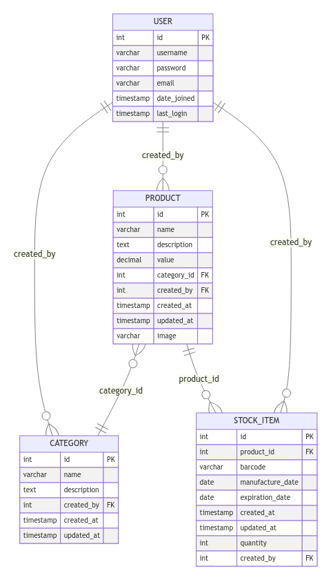

## **Banco de Dados**

### Conteúdo
1. Estudo sobre tipos de Bancos de Dados (relacionais, não relacionais, etc.)

2. Modelo Entidade Relacionamento (MER)
    - Entidade
    - Relacionamento
    - Cardinalidade
    - Atributos
    - Generalização / Especialização
    - Entidade Associativa
    - Criação de Diagrama Entidade Relacionamento (DER) na ferramenta brModelo (ou outra similar)

3. Modelo Relacional (MR)
    - Transformação entre modelos (MER - MR)
    - Restrições (chaves primárias, secundárias, etc.)
    - Normalização (até a terceira forma normal)

4. Comandos SQL (utilizar MySQL e/ou PostgreSQL e/ou SQLite)
    - Criação de Banco de Dados e Tabelas
    - Alterações e Restrições
    - Consultas Básicas e Avançadas (select e suas restrições)
    - INSERT, UPDATE e DELETE
    - Agrupamento de tabelas (JOINS)
    - GROUP BY, HAVING e Funções de Agregações

5. PROJETO
    - Criar um Projeto de Banco de Dados, desde um nível de abstração mais elevado, como Modelo ER (através do diagrama ER), passando para o modelo relacional (tabelas simples, tabelas com relacionamentos, etc.) até o projeto no Banco de Dados (pode usar MySQL e/ou PostgreSQL e/ou SQLite e/ou outro que você achar válido, o interessante é praticar, inclusive em mais de um). Nesse projeto, deverá ser possível consultar, inserir, deletar e atualizar informações em um Banco de Dados, respeitando o relacionamento entre os dados e as devidas restrições.

